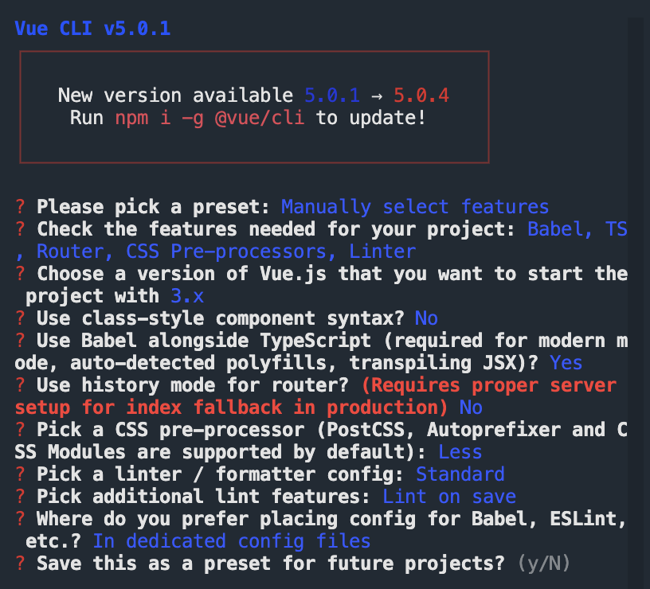

# ts-bilibili

## Project setup

```
npm install
```

### Compiles and hot-reloads for development

```
npm run serve
```

### Compiles and minifies for production

```
npm run build
```

### Lints and fixes files

```
npm run lint
```

### Customize configuration

See [Configuration Reference](https://cli.vuejs.org/config/).

## VUE/CLI setting



1. `vue create projName`
2. `Manual: Babel, TS, Router, CSS Pre-processors, Linter`
3. `Vue.js version: 3.x`
4. `Class-style component syntax: No`
5. `Babel alongside TS: Yes`
6. `History mode for router: No`
7. `CSS Pre-processor: Less`
8. `Linter: standard`
9. `In dedicated config files`

## 下载 3.2 版本的 vue/最新版

`npm i vue@next`

## 安装 mockjs

`npm i mockjs`
`npm i -S @types/mockjs`
